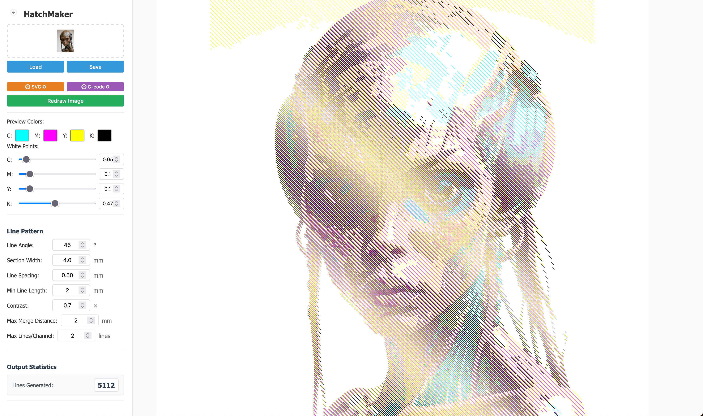
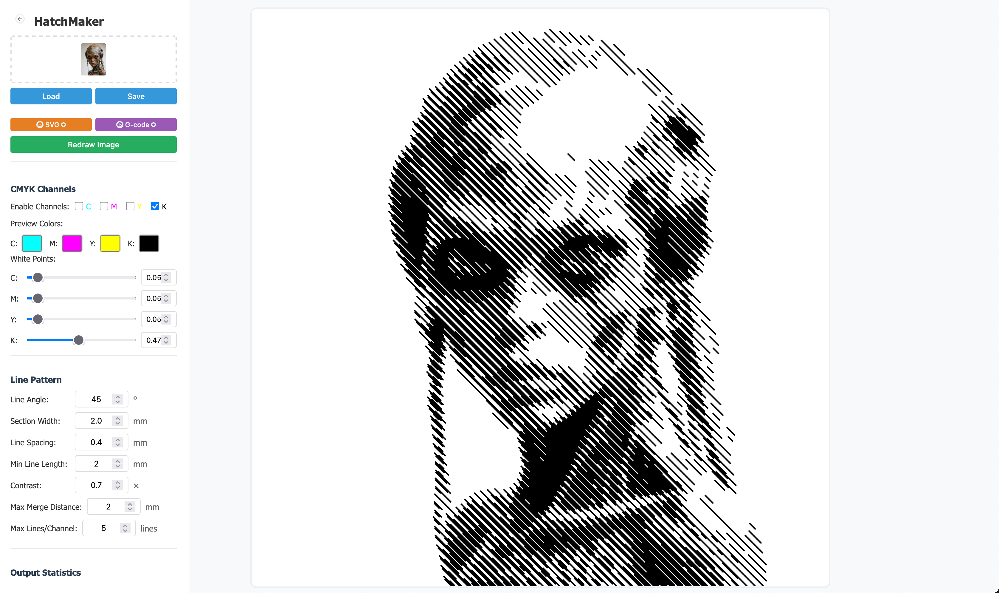

# LineMaker

🌐 **Try it online**: [https://the-nils.github.io/LineMaker/](https://the-nils.github.io/LineMaker/)

A collection of web-based tools for CNC pen plotting, built for my personal hobby project and 100% generated by AI.

## What's This?

I built a pen mount for my CNC machine and needed some tools to generate line art for it. Rather than spend weeks coding, I decided to experiment with AI-assisted development. This entire project is an exercise in human-AI collaboration (okay, mostly AI doing the heavy lifting while I provide coffee and feedback).

## Current Tools

### 🎨 HatchMaker

- **What it does**: Converts images into hatched line art suitable for pen plotting
- **Features**:
  - CMYK channel separation for multi-color plots
  - Interactive canvas with pan/zoom
  - Drag & drop image upload
  - Configurable line patterns, spacing, and angles
  - SVG and G-code export
  - Save/load configurations

_HatchMaker converting an image to CMYK hatched patterns_

_HatchMaker black and white line art output_

### 🌀 HatchMoiréMaker

- **What it does**: Creates stunning moiré effects by overlaying multiple hatched layers from the same image
- **Features**:
  - Multi-layer moiré pattern generation
  - Independent parameters per layer (offset, angle, skew)
  - Dynamic layer management (add/remove layers)
  - Per-layer white point and line spacing controls
  - Optimized SVG and G-code generation with 70-90% file size reduction
  - Travel move visualization for continuous pen-down drawing
  - Configuration save/load with import/export capabilities

_HatchMoiréMaker generating complex moiré interference patterns_

### ⚡ FieldLines

- **What it does**: Creates organic field line patterns by simulating force fields from points and drawn lines
- **Features**:
  - Interactive point placement with attract/repulse modes
  - Photoshop-style curve editor for precise force falloff control
  - Draw custom field lines directly on canvas
  - Multi-layer system with independent parameters per layer
  - Real-time field visualization and line deformation
  - Advanced recursive subdivision for smooth curves
  - Configuration save/load system
  - SVG and G-code export with travel optimization

_FieldLines generating organic patterns through simulated force fields_

## Coming... Eventually

More tools are planned when I find time to prompt-engineer them into existence:

- **echolocationMaker**
- **scribleMaker**
- **mazeMaker**
- **orbitMaker**

## Fair Warning

This is a **hobby project** with the following disclaimers:

- 🤖 **100% AI Generated**: Every line of code came from AI assistance. I'm a developer, but I wanted to see how far I could push AI to build something useful.
- 🎲 **Quality Varies**: Some parts are surprisingly elegant, others make experienced developers weep. It's a mixed bag.
- 🔄 **Updates Maybe**: I'll update this when I feel like it or when something breaks badly enough to annoy me.
- 🐛 **Bugs Expected**: Find one? Cool, open an issue. Fix one? Even cooler, send a PR.
- 📚 **Learning Exercise**: This project is as much about learning to work with AI tools as it is about pen plotting.

## Getting Started

1. Clone this repo
2. Open `index.html` in a web browser
3. Choose your tool:
   - **HatchMaker**: For CMYK channel separation and traditional hatching
   - **HatchMoiréMaker**: For complex moiré interference patterns
   - **FieldLines**: For organic field line patterns using force field simulation
4. Upload an image
5. Fiddle with settings until it looks good
6. Export SVG or G-code
7. Send to your CNC/plotter
8. Watch it draw things

No build process, no dependencies, no npm hell. Just HTML, CSS, and JavaScript doing their thing.

## Contributing

Contributions are welcome! Whether you're:

- A human who found a bug
- A human who wants to add features
- An AI that gained sentience and wants to improve its own work
- Someone who just wants to make the code less embarrassing

Feel free to open issues or PRs. I can't promise quick responses, but I do read everything.

## Technical Notes

- **Framework**: Vanilla JS (because why complicate things?)
- **Architecture**: "It works on my machine" driven development
- **Testing Strategy**: Manual clicking and hoping
- **Documentation**: The code IS the documentation (good luck)

## License

MIT License - do whatever you want with this. If it breaks your CNC machine, that's between you and your machine.

## Acknowledgments

- **Claude AI**: For writing most of this code while I provided enthusiastic but often unhelpful suggestions
- **My CNC Machine**: For being patient while I figured out how to make it draw instead of cut
- **The Pen Mount**: A simple 3D printed part that started this whole adventure
- **Stack Overflow**: For existing, even though I barely used it for this project

---

_Built with AI assistance, caffeine, and questionable life choices. Your mileage may vary._
